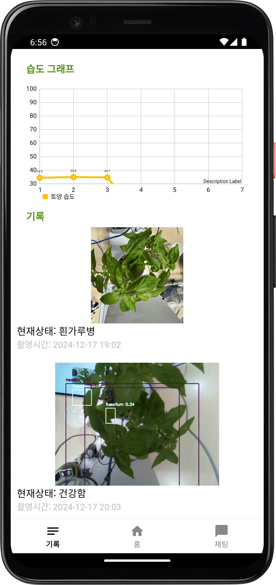

# [24-2 센서프로그래밍] 가정용 스마트팜 (라즈베리파이)

## 👋 Introduction
| 프로젝트명   | GreenPulse                                                                                  |
|---------|---------------------------------------------------------------------------------------------|
|    개발 기간  | 2024.10 - 2024.12                                                                           |
| 개발 인원   | 팀 2명 ( 장민정 / 최지훈 )                                                                          |
| 사용 센서   | 온습도 센서, 토양 습도 센서                                                                            |
| 사용 하드웨어 | 라즈베리파이, 워터 펌프 모터, MCP3008, 릴레이, 9v 배터리                                                      |
| 개발 언어   | Python, Kotlin                                                                              |
| 사용 기술   | (데이터베이스) Firebase   (온습도 측정) Adafruit_DHT   (GPIO 동작) RPi.GPIO   (토양 습도 센서) spidev |

## 🌱 스마트팜

## 📱 GreenPulse 애플리케이션
|  |  |  |
|:-----------------------:|:-----------------------:|:-----------------------:|
| **메인 화면**          | **채팅 화면**          | **기록 화면**          |

## 📹 시연 영상

## Role & Member
| 구성원 | 장민정            | 최지훈  |
|-----|----------------|------|
| 업무  |  |      |
